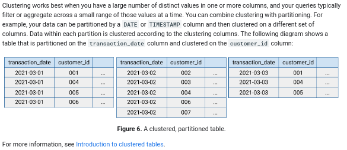

# bigquery_interview_preparation
:sunglasses: 

## Theorical Questions Section

### Theorical Question 1

Federated queries

<b>Answer</b>

Federated queries let you read data from external sources  (not stored in bigquery)

<b>Source</b>

https://cloud.google.com/bigquery/docs/introduction

### Theorical Question 2

Do you know what On-demand compute (analysis) pricing

<b>Answer</b>

By default, queries are billed using the on-demand (per TB) pricing model, where you pay for the data scanned by your queries.

With on-demand pricing, you will generally have access to up to 2,000 concurrent slots, shared among all queries in a single project. Periodically, BigQuery will temporarily burst beyond this limit to accelerate smaller queries. In addition, you might occasionally have fewer slots available if there is a high amount of contention for on-demand capacity in a specific location.

<b>Source</b>

https://cloud.google.com/bigquery/pricing#storage

### Theorical Question 3

Do you know what Capacity compute (analysis) pricing

<b>Answer</b>

Pricing for BigQuery editions is based on units of compute (slot hours) and offers pay as you go pricing (with autoscaling) and optional one year and three year commitments. 

<b>Source</b>

https://cloud.google.com/bigquery/pricing#storage

### Theorical Question 4

Do you know what is Flat-rate compute (analysis) pricing

<b>Answer</b>

When you enroll in capacity pricing, you purchase dedicated query processing capacity, measured in BigQuery slots. Your queries consume this capacity, and you are not billed for bytes processed. If your capacity demands exceed your committed capacity, BigQuery will queue up slots, and you will not be charged additional fees.  

<b>Source</b>

https://cloud.google.com/bigquery/pricing#storage

### Theorical Question 5

BI Engine pricing

<b>Answer</b>

BI Engine accelerates SQL queries by caching BigQuery data in memory. The amount of data stored is constrained by the amount of capacity you purchase. To purchase BI Engine capacity, create a BI Engine reservation in the project where queries will be run.

<b>Source</b>

https://cloud.google.com/bigquery/pricing#storage

### Theorical Question 6

Do you know what table clone

<b>Answer</b>

Table clones are lightweight, writable copies of standard tables. BigQuery only stores the delta between a table clone and its base table.

<b>Source</b>

https://cloud.google.com/bigquery/docs/storage_overview

### Theorical Question 7

Do you know what table snapshot

<b>Answer</b>

Table snapshots are point-in-time copies of tables. Table snapshots are read-only, but you can restore a table from a table snapshot. BigQuery only stores the delta between a table snapshot and its base table.

<b>Source</b>

https://cloud.google.com/bigquery/docs/storage_overview

### Theorical Question 8

Do you know what Materialized views

<b>Answer</b>

Table snapshots are point-in-time copies of tables. Table snapshots are read-only, but you can restore a table from a table snapshot. BigQuery only stores the delta between a table snapshot and its base table.

<b>Source</b>

https://cloud.google.com/bigquery/docs/storage_overview

### Theorical Question 9

What data type can you use as partition key

<b>Answer</b>

A time-unit column, such as a DATE or DATETIME column.

An integer column

The time when the data was ingested. In this case, BigQuery automatically stores the ingestion time in a pseudo-column that is not part of the table schema.

<b>Source</b>

https://cloud.google.com/bigquery/docs/storage_overview

### Theorical Question 10

Clustering

<b>Answer</b>

<b>Source</b>

https://cloud.google.com/bigquery/docs/storage_overview

### Theorical Question 11

Intro Optimization

<b>Answer</b>

<b>Source</b>

https://cloud.google.com/bigquery/docs/storage_overview

### Theorical Question 12

Table Expiration day

<b>Answer</b>

<b>Source</b>

https://cloud.google.com/bigquery/docs/managing-tables#sql_1

### Theorical Question 13

Data lineage and whad tool to use

<b>Answer</b>

Data lineage is a Dataplex feature that lets you track how data moves through your systems: where it comes from, where it is passed to, and what transformations are applied to it. 

<b>Source</b>

https://cloud.google.com/bigquery/docs/managing-tables#sql_1

### Theorical Question 14

Intro Cloud monitoring

<b>Answer</b>

 

 

<b>Source</b>

https://cloud.google.com/monitoring/dashboards

### Theorical Question 15

Cloud Monitoring Samples

<b>Answer</b>

https://cloud.google.com/monitoring/docs/samples

https://cloud.google.com/docs/samples

<b>Source</b>

https://cloud.google.com/monitoring/dashboards

### Theorical Question 16

Here you are monitoring how many products you are checking with cloud monitoringCloud Monitoring Samples

<b>Answer</b>

 

<b>Source</b>

https://www.youtube.com/watch?v=_FKdug6B5FM

### Theorical Question 17

Cloud logging

<b>Answer</b>

If you want to execute some action and see the result in real time there is a streaming log options that can show that streaming in the cloud logging service UI or in console using gcloud

 

<b>Source</b>

https://www.youtube.com/watch?v=IlUCyV8mcS0

### Theorical Question 18

In biquery datasets what does it mean logical and phisical billing

<b>Answer</b>

If you want to execute some action and see the result in real time there is a streaming log options that can show that streaming in the cloud logging service UI or in console using gcloud

 

 

<b>Source</b>

https://cloud.google.com/bigquery/docs/datasets

### Theorical Question 19

Difference between views and materialized views

<b>Answer</b>

If you want to execute some action and see the result in real time there is a streaming log options that can show that streaming in the cloud logging service UI or in console using gcloud

 

 

<b>Source</b>

https://cloud.google.com/bigquery/docs/datasets

### Theorical Question 20

Access control tables

<b>Answer</b>
 

 

<b>Source</b>

https://cloud.google.com/bigquery/docs/datasets

### Theorical Question 21

Partitioning by integerm datetime and ingestion date

<b>Answer</b>

 

 

 

 

<b>Source</b>

https://cloud.google.com/bigquery/docs/datasets

### Theorical Question 22

When is prunning (using only the require partitions) not executed.
In other words when will it scan the whole table even of you use the where clause.

By the way, I think you should analize if this is actually prunning data using the query plan.

<b>Answer</b>

 

 
 

<b>Source</b>

https://cloud.google.com/bigquery/docs/datasets

### Theorical Question 23

why should you beware of dry-run and query cost when dealing with clustered tables

<b>Answer</b>

When you query a clustered table, you do not receive an accurate query cost estimate before query execution because the number of storage blocks to be scanned is not known before query execution. The final cost is determined after query execution is complete and is based on the specific storage blocks that were scanned.

<b>Source</b>

https://cloud.google.com/bigquery/docs/clustered-tables

### Theorical Question 24

When to use clustering (reads the rest of the page and the videos about performance)

<b>Answer</b>

When you query a clustered table, you do not receive an accurate query cost estimate before query execution because the number of storage blocks to be scanned is not known before query execution. The final cost is determined after query execution is complete and is based on the specific storage blocks that were scanned.

<b>Source</b>

https://cloud.google.com/bigquery/docs/clustered-tables

### Theorical Question 25

how should you query a clustered table

<b>Answer</b>

To optimize performance when you run queries against clustered tables, use an expression that filters on a clustered column or on multiple clustered columns in the order the clustered columns are specified. Queries that filter on clustered columns generally perform better than queries that filter only on non-clustered columns.

<b>Source</b>

https://cloud.google.com/bigquery/docs/querying-clustered-tables

### Theorical Question 26

Do you understand the difference between biglake table and external table ???? or why you should upgrade external table to biglake

<b>Answer</b>

BigLake tables let you query structured data in external data stores with access delegation. Access delegation decouples access to the BigLake table from access to the underlying data store. An external connection associated with a service account is used to connect to the data store. Because the service account handles retrieving data from the data store, you only have to grant users access to the BigLake table. This lets you enforce fine-grained security at the table level, including row-level and column-level security. For BigLake tables based on Cloud Storage, you can also use dynamic data masking. To learn more about multi-cloud analytic solutions using BigLake tables with Amazon S3 or Blob Storage data, see BigQuery Omni.

<b>Source</b>

https://cloud.google.com/bigquery/docs/biglake-intro

### Theorical Question 27

when should you use metada caching with biglake tables

<b>Answer</b>

Materialized views over BigLake metadata cache-enabled tables can be used to improve performance and efficiency when querying structured data stored in Cloud Storage. These materialized views function like materialized views over BigQuery-managed storage tables, including the benefits of automatic refresh and smart tuning.

BigLake and object tables support caching metadata about files from Cloud Storage. The metadata includes file names, partitioning information, and physical metadata from files such as row counts. You can choose whether or not to enable metadata caching on a table. Queries with a large number of files and with Hive partition filters benefit the most from metadata caching.

<b>Source</b>

https://cloud.google.com/bigquery/docs/biglake-intro

